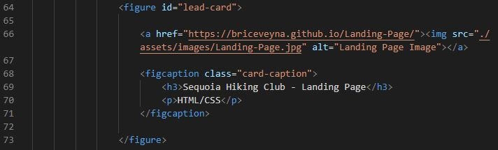

# Portfolio
This is a portfolio of my software development related projects.

## Description
This project is a portfolio containing examples of my software development related projects. It contains a brief biography of my work experience with a current photo, links to projects using various programming languages, and my contact information.

### Deployed Application
[Brice-Veyna-Portfolio](https://briceveyna.github.io/Portfolio/)

### Badges
  

## Usage
The projects links are implemented through the use of large cards with image links imbedded leading to the deployed applications.

## Questions
If you have any additional questions, feel free to reach out.
- [Github](https://github.com/BriceVeyna)
- [LinkedIn](https://www.linkedin.com/in/brice-veyna/)
- Email: briceveyna@gmail.com

## License
Brice Veyna's Portfolio is licensed under the [MIT License](https://opensource.org/licenses/MIT).

Copyright 2022 Brice Veyna

Permission is hereby granted, free of charge, to any person obtaining a copy of this software and associated documentation files (the "Software"), to deal in the Software without restriction, including without limitation the rights to use, copy, modify, merge, publish, distribute, sublicense, and/or sell copies of the Software, and to permit persons to whom the Software is furnished to do so, subject to the following conditions:

The above copyright notice and this permission notice shall be included in all copies or substantial portions of the Software.

THE SOFTWARE IS PROVIDED "AS IS", WITHOUT WARRANTY OF ANY KIND, EXPRESS OR IMPLIED, INCLUDING BUT NOT LIMITED TO THE WARRANTIES OF MERCHANTABILITY, FITNESS FOR A PARTICULAR PURPOSE AND NONINFRINGEMENT. IN NO EVENT SHALL THE AUTHORS OR COPYRIGHT HOLDERS BE LIABLE FOR ANY CLAIM, DAMAGES OR OTHER LIABILITY, WHETHER IN AN ACTION OF CONTRACT, TORT OR OTHERWISE, ARISING FROM, OUT OF OR IN CONNECTION WITH THE SOFTWARE OR THE USE OR OTHER DEALINGS IN THE SOFTWARE.